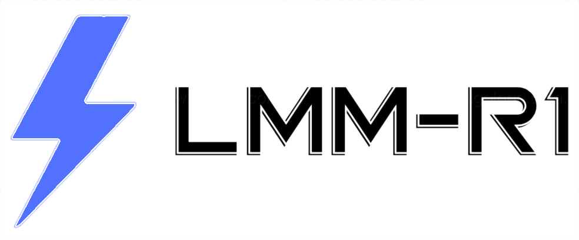
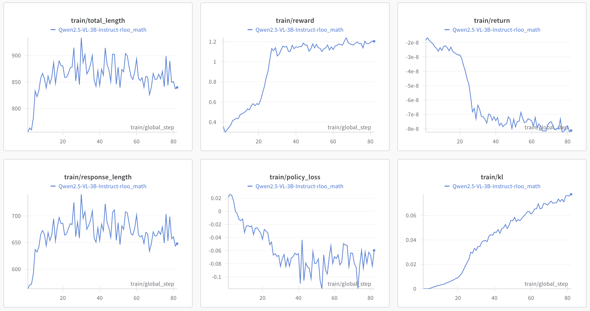

<div align="center">
    
</div>
<div align="center">
<p align="center">
      <a href="https://github.com/TideDra/lmm-r1/graphs/contributors">
        
      </a>
      <a href="https://github.com/TideDra/lmm-r1/issues">
        
      </a>
      <a href="https://github.com/TideDra/lmm-r1/discussions">
        
      </a>
      <a href="https://github.com/TideDra/lmm-r1/pulls">
        
      <a href="https://github.com/TideDra/lmm-r1/stargazers">
        
      </a>
      <br>
      <em>Open-source / Comprehensive / Lightweight / Easy-to-use</em>
    </p>
</p>
</div>

<hr>


LMM-R1 is a fork of [OpenRLHF](https://github.com/OpenRLHF/OpenRLHF), aimed at providing high-performance LMM Reinforcement Learning infrastructure for reproduction of DeepSeek-R1 on multimodal tasks.

- **Simple and easy to use**: OpenRLHF is one of the simplest high-performance RLHF libraries currently available, and seamlessly compatible with Huggingface models and datasets.
- **High performance**: RL training spends 80% of the time on the sample generation stage. Thanks to the ability to use a large inference batch size with Ray and Packing Samples and vLLM generation acceleration, the performance of OpenRLHF 3~4x+ that of Optimized DeepSpeedChat with Hybrid Engine.
- **Distributed RLHF**:  OpenRLHF distribute the Actor, Reward, Reference, and Critic models onto separate GPUs using Ray, while placing the Adam optimizer on the CPU. This enables full-scale fine-tuning of 70B+ models with multiple A100 80G GPUs and vLLM and 7B models across multiple 24GB RTX 4090 GPUs.
- **PPO Implementation Optimization**: We integrated the implementation tricks for PPO to improve the training stability, referencing [Zhihu](https://zhuanlan.zhihu.com/p/622134699) and [Advanced Tricks for Training Large Language Models with Proximal Policy Optimization](https://hijkzzz.notion.site/rlhf-implementation-tricks?v=158d9a33ecc98132bf9e000c39227361).

More details are in [Slides](https://docs.google.com/presentation/d/1JRhB1d7csofx0PIZBmfyBdMluxNd5JLPpUHrrvVhGnk/edit?usp=sharing) | [Technical Report](https://arxiv.org/abs/2405.11143) | [Documents](https://openrlhf.readthedocs.io/)

Team:

[Gongrui Zhang](https://github.com/TideDra) | [YingZhe Peng](https://github.com/ForJadeForest)

## News
- [2025/2/13] We release code of LMM-R1!

## Our Findings
### Super cross-modal generation ability of rule-based RL
We train Qwen2.5-VL-3B-Instruct on 8k text-only MATH (level3-5) dataset using RLOO with a rule-based reward function. We find it gains significant improvement on challenging multi-modal math benchmarks (MathVision, MathVerse, Olympiadbench_en).

|               |   MathVision  |    MathVerse   | Olympiadbench_en |
| ------------- |:-------------:| :-------------:| :-------------:|
| Qwen2.5-VL-3B-Instruct | 23.09 | 27.99 | 10.15 |
| Qwen2.5-VL-3B-Instruct-rloo-math | **27.47** | **35.1** | **13.32** |



This result reminds us that the existing rich high-quaity text-modality reasoning data maybe beneficial to train a strong multimodal reasoning model, especially at this very moment when high-quality multimodal reasoning data is scarce.

### More findings are coming...

## Features
- Support LMM training (Qwen2-VL, Qwen2.5-VL).
- Distributed [PPO](./examples/scripts/train_ppo_llama_ray.sh) and [REINFORCE++/RLOO](./examples/scripts/train_reinforce_llama_ray.sh) implementations based on Ray.  
- [Ray-based Reinforced Finetuning](./examples/scripts/train_ppo_llama_with_reward_fn.sh)
- Support Ray-based [PPO](./examples/scripts/train_ppo_llama_ray_hybrid_engine.sh) and [REINFORCE++/RLOO](./examples/scripts/train_reinforce_llama_ray_hybrid_engine.sh) using Hybrid Engine  (`--colocate_all_models`, `--vllm_enable_sleep` and `--vllm_gpu_memory_utilization 0.5`)
- Full RLHF fine-tuning support for models with [over 70 billion parameters](./examples/scripts/train_ppo_llama_ray_70b.sh).  
- Integration with vLLM for accelerated generation in RLHF tasks (`--vllm_num_engines`).  
- Support for multiple reward models (`--reward_pretrain model1,model2...`) and remote reward models (`--remote_rm_url`).
- Integration of FlashAttention2 (`--flash_attn`).  
- Support for QLoRA (`--load_in_4bit`) and [LoRA](./examples/scripts/train_sft_mixtral_lora.sh) (`--lora_rank`, `--target_modules`).  
- Compatibility with HuggingFace's `tokenizer.apply_chat_template` for datasets (`--apply_chat_template` and `--input_key`).  
- Logging support with Wandb (`--use_wandb`) and TensorBoard (`--use_tensorboard`).  
- Checkpoint recovery functionality (`--load_checkpoint` and `--save_steps`).  
- Provided multi-node training scripts, such as [Ray PPO](./examples/scripts/train_ppo_llama_ray_slurm.sh).


### PPO Support Matrix

| Feature | OpenRLHF | DSChat | CAIChat | TRL |
| ------------- |:-------------:| :-------------:| :-------------:| :-------------:|
| 70B+ Full Tuning with 16 A100-80GB      | ✅ | ❌ | ❌ | ❌ |
| 7B Full Tuning with 4 RTX4090 | ✅      |    ❌ | ❌ | ❌ |
| 34B DPO Full Tuning with 8 A100-80GB | ✅      |    ❌ | ❌ | ❌ |  
| Inference Engine in PPO | ✅      |    ✅ | ❌ | ❌ |  
| PPO Implementation Tricks | ✅      |    ❌ | ❌ | ✅ |
| Support QLoRA | ✅      |    ❌ | ❌ | ✅ | 
| Support Mixtral 8*7b | ✅      |    ❌ | ❌ | ❌ |  
| Support Unmerged Actor-Critic | ✅     |   ✅ | ✅ | ❌ | 
| Support Multiple Reward Models | ✅      |    ❌ | ❌ | ❌ |   
| Support Huggingface Models | ✅      |    ✅ | ✅ | ✅ | 
| Easy-to-use | ✅      |   ❌ (HybridEngine bugs) | ✅ | ✅ | 


## Quick Start

### Installation

```bash
git clone https://github.com/TideDra/lmm-r1.git
cd lmm-r1
pip install -e .[vllm]
pip install flash_attn --no-build-isolation
```

> [!NOTE]
>We recommend using vLLM 0.7.2 or higher.
>We also provided the [Dockerfiles for vLLM](./dockerfile/) and [One-Click Installation Script of Nvidia-Docker](./examples/scripts/nvidia_docker_install.sh).

### Prepare Datasets
LMM-R1 requires the multimodal prompt dataset to be in OpenAI-compatible message format:
```json
[
  {
    "message":"[
      {
        \"role\": \"user\",
        \"content\": [
            { \
                \"type\": \"image\",
                \"image\": \"file:///path/to/your/image.jpg\",
            }, \
            {\"type\": \"text\", \"text\": \"How many cats in the image?\"},
        ],
      }
    ]",
    "answer": "$3$"
  },
]
```
**Note that message is a stringfied list.**
An example dataset `examples/data/test_message.jsonl` is for reference.

- We can use `--input_key` to specify the `JSON key name` of the input datasets `--prompt_data {name or path}` (PPO) or `--dataset {name or path}`. **Do not** use `--apply_chat_template` for multimodal prompt, the message will be processed internally.
- OpenRLHF also support mixing multiple datasets using `--prompt_data_probs 0.1,0.4,0.5` (PPO) or `--dataset_probs 0.1,0.4,0.5`.


How to specify training and test datasets ?

You can specify it using the `data_type@data_dir` format. For example, the dataset can be set as `--dataset json@./data`.

```
data
├── test.jsonl
└── train.jsonl
```

> [!NOTE]
> By default, we use `train` and `test` as splits to distinguish training and testing datasets from Huggingface.
> The ``JSON key`` options depends on the specific datasets. See [Reward Dataset](https://github.com/OpenRLHF/OpenRLHF/blob/main/openrlhf/datasets/reward_dataset.py#L10) and [SFT Dataset](https://github.com/OpenRLHF/OpenRLHF/blob/main/openrlhf/datasets/sft_dataset.py#L9)


### LMM RLOO with Ray
> [!NOTE]
> Set `--train-vlm` for LMM training.

```bash
DATASET="test_message.jsonl"
MODEL_CPK_NAME="qwenvl25_3B_ins_rloo_mathvision"
PRETRAIN_MODEL="Qwen/Qwen2.5-VL-3B-Instruct"
SAVE_PATH="/ckpts"
mkdir -p "${SAVE_PATH}/${MODEL_CPK_NAME}"

# deploy remote reward function at 127.0.0.1:5000
python -m openrlhf.models.remote_rm.math_verifier --dataset $DATASET --input_key message --prompt-template chatml > "${SAVE_PATH}/${MODEL_CPK_NAME}/remote_rm.log" 2>&1 &
childpid=$!

ray start --head --node-ip-address 0.0.0.0 --num-gpus 8 --temp-dir ~/.cache/ray

ray job submit --address="http://127.0.0.1:8265" \
   --runtime-env-json='{"working_dir": "/root/projects/OpenRLHF"}' \
   -- python3 -m openrlhf.cli.train_ppo_ray \
   --ref_num_nodes 1 \
   --ref_num_gpus_per_node 8 \
   --remote_rm_url http://127.0.0.1:5000//get_reward \
   --actor_num_nodes 1 \
   --actor_num_gpus_per_node 8 \
   --vllm_num_engines 8 \
   --vllm_tensor_parallel_size 1 \
   --colocate_all_models \
   --vllm_enable_sleep \
   --vllm_gpu_memory_utilization 0.7 \
   --vllm_sync_backend gloo \
   --enable_prefix_caching \
   --pretrain $PRETRAIN_MODEL \
   --save_path $SAVE_PATH/$MODEL_CPK_NAME \
   --micro_train_batch_size 2 \
   --train_batch_size 128 \
   --micro_rollout_batch_size 4 \
   --rollout_batch_size 256 \
   --temperature 1 \
   --n_samples_per_prompt 16 \
   --max_epochs 1 \
   --num_episodes 30 \
   --prompt_max_len 4096 \
   --max_samples 100000 \
   --generate_max_len 4096 \
   --advantage_estimator rloo \
   --zero_stage 3 \
   --bf16 \
   --actor_learning_rate 1e-6 \
   --init_kl_coef 0.01 \
   --prompt_data $DATASET \
   --input_key message \
   --normalize_reward \
   --flash_attn \
   --gradient_checkpointing \
   --save_steps 10 \
   --ckpt_path $SAVE_PATH/$MODEL_CPK_NAME/ckpt \
   --save_hf_ckpt \
   --use_tensorboard $SAVE_PATH/$MODEL_CPK_NAME/logs \
   --train_vlm

ray stop
kill $childpid
```

> [!NOTE]
> Not set `--vllm_num_engines` means not using the vLLM engine.


> [!NOTE]
> RLOO in OPENRLHF is a modification based on REINFORCE++, differing from the original version.

> [!NOTE]
> If you encounter an error related to index out of range when deepspeed sets up the GPU devices, you can try to set the environment variable [`RAY_EXPERIMENTAL_NOSET_*_VISIBLE_DEVICES`](openrlhf/trainer/ray/utils.py) as a workaround.
>   ```bash
>   # For NVIDIA GPUs:
>   export RAY_EXPERIMENTAL_NOSET_CUDA_VISIBLE_DEVICES=1
>   ```


### Performance Tuning Guide

To achieve optimal performance, we recommend allocating nodes number `vLLM:Actor:Critic = 1:1:1`. For example, for a 70B model with 48 A100 GPUs, it is advised to allocate 16 A100 GPUs to the vLLM Engine, 16 GPUs to the Actor model, and the remaining 16 GPUs to the Critic model. Additionally, enable the `--colocate_critic_reward`, `--colocate_actor_ref` options to merge nodes. Finally, you should increase the `rollout_micro_batch_size` (and minimize the TP size of vLLM engine) as much as possible. During the training phase, a larger `--micro_train_batch_size` is better and enable `--packing_samples` (Not supported for LMM). When there are enough GPUs, please disable `--adam_offload` and enable `--overlap_comm`. For multi-nodes RLHF, please use `--vllm_sync_backend nccl` with vLLM 0.7.2+. Enable `enable_prefix_caching` in vLLM generation when ``n_samples_per_prompts`` > 1. Using hybrid engine `--colocate_all_models` and ``–vllm_enable_sleep``rather than distributed RLHF when the model size and context length are small values.


## Starchart

[](https://star-history.com/#TideDra/llm-r1&Date)


## References & Acknowledgements

- [OpenRLHF](https://github.com/OpenRLHF/OpenRLHF)
- [open-r1](https://github.com/huggingface/open-r1)
