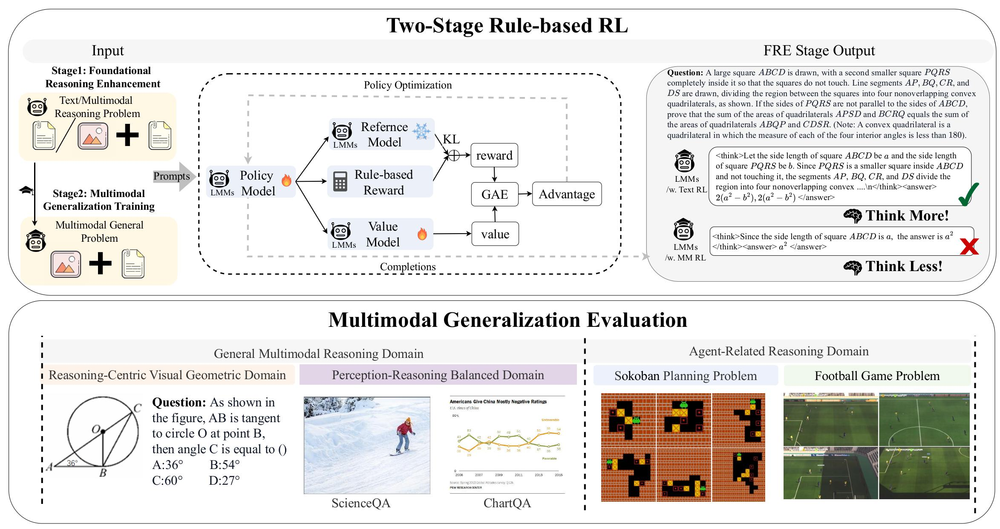
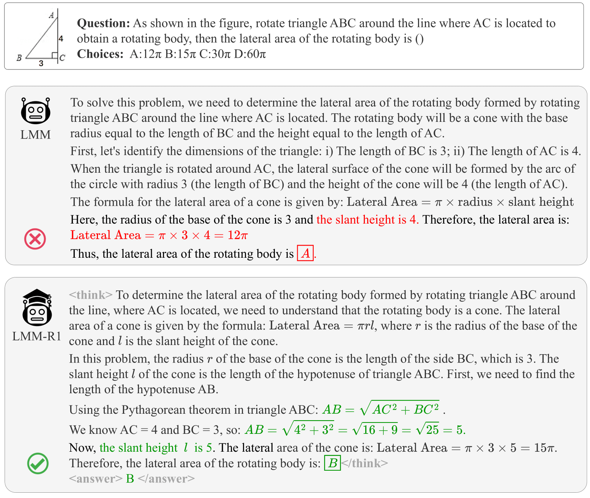
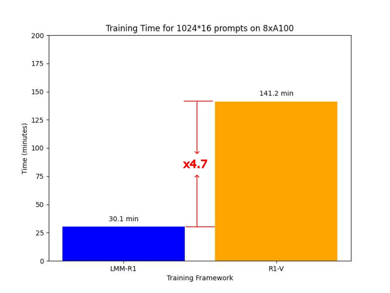

<div align="center">
    
</div>

# LMM-R1: Empowering 3B LMMs with Strong Reasoning Abilities

<div align="center">
<p align="center">
      <a href="https://github.com/TideDra/lmm-r1/graphs/contributors">
        
      </a>
      <a href="https://github.com/TideDra/lmm-r1/issues">
        
      </a>
      <a href="https://github.com/TideDra/lmm-r1/discussions">
        
      </a>
      <a href="https://github.com/TideDra/lmm-r1/pulls">
        
      <a href="https://github.com/TideDra/lmm-r1/stargazers">
        
      </a>
      <br>
      <em>Open-source / Comprehensive / Lightweight / Easy-to-use</em>
    </p>
</p>
</div>


<hr>

[](https://huggingface.co/datasets/VLM-Reasoner/VerMulti) [](https://huggingface.co/VLM-Reasoner/LMM-R1-MGT-PerceReason) [](https://arxiv.org/pdf/2503.07536) [](https://forjadeforest.github.io/LMM-R1-ProjectPage/)

[Switch to the Chinese version (切换至中文版)](/README_zh.md)

## News
- [2025/3/11] 🚀 Our codebase is merged into [OpenRLHF-M](https://github.com/OpenRLHF/OpenRLHF-M), the official multimodal RL infrastructure developed by OpenRLHF.
- [2025/3/11] ✨ We release our paper "[LMM-R1: Empowering 3B LMMs with Strong Reasoning Abilities Through Two-Stage Rule-Based RL](https://arxiv.org/pdf/2503.07536)"!

- [2025/2/13] We release code of LMM-R1!

## Introduction

Smaller 3B Large Multimodal Models (LMMs) struggle with reasoning tasks due to their limited parameter capacity and the inherent complexity of integrating visual perception with logical reasoning. High-quality multimodal reasoning data is also scarce, further complicating training. To address these challenges, we propose **LMM-R1**, a two-stage rule-based RL framework that efficiently enhances reasoning capabilities:

1. **Foundational Reasoning Enhancement (FRE)**: Uses text-only data to build strong reasoning foundations
2. **Multimodal Generalization Training (MGT)**: Extends these capabilities to multimodal domains

This approach overcomes data limitations while significantly improving performance across diverse reasoning tasks.


## Demo
**Geometry Question:**



**Sokoban Demo:**


 
## Quick Start

### Installation

```bash
git clone https://github.com/TideDra/lmm-r1.git
cd lmm-r1
pip install -e .[vllm]
pip install flash_attn --no-build-isolation
```

> [!NOTE]
>We recommend using vLLM 0.7.2 or higher.
>We also provided the [Dockerfiles for vLLM](./dockerfile/) and [One-Click Installation Script of Nvidia-Docker](./examples/scripts/nvidia_docker_install.sh).

### Prepare Datasets

LMM-R1 requires the multimodal prompt dataset to be in OpenAI-compatible message format:
```json
[
  {
    "message":"[
      {
        \"role\": \"user\",
        \"content\": [
            { \
                \"type\": \"image\",
                \"image\": \"file:///path/to/your/image.jpg\",
            }, \
            {\"type\": \"text\", \"text\": \"How many cats in the image?\"},
        ],
      }
    ]",
    "answer": "$3$"
  },
]
```
**Note that message is a stringfied list.**
An example dataset `examples/data/test_message.jsonl` is for reference.

- We can use `--input_key` to specify the `JSON key name` of the input datasets `--prompt_data {name or path}` (PPO) or `--dataset {name or path}`. **Do not** use `--apply_chat_template` for multimodal prompt, the message will be processed internally.
- OpenRLHF also support mixing multiple datasets using `--prompt_data_probs 0.1,0.4,0.5` (PPO) or `--dataset_probs 0.1,0.4,0.5`.

### Training

Our training process follows the two-stage approach described in the paper. We provide scripts for each stage to facilitate reproduction of our results.

#### Stage 1: Foundational Reasoning Enhancement (FRE)

This stage focuses on enhancing the model's reasoning capabilities using text-only data.

```bash
# Train with text-only data (FRE-Text)
bash examples/scripts/lmm_r1/train_fre_text.sh

# Train with multimodal data (FRE-Multi) for comparison
bash examples/scripts/lmm_r1/train_fre_multi.sh
```

The FRE-Text script uses the [DeepScaler-40K](https://huggingface.co/datasets/VLM-Reasoner/deepscaler) dataset with rule-based RL to enhance the model's foundational reasoning capabilities. This stage is crucial for establishing strong reasoning abilities before moving to multimodal tasks.

#### Stage 2: Multimodal Generalization Training (MGT)

This stage extends the reasoning capabilities to multimodal domains through continued training on specific tasks.

```bash
# Train on geometry domain (MGT-Geo)
bash examples/scripts/lmm_r1/train_mgt_geo.sh

# Train on perception-reasoning balanced domain (MGT-PerceReason)
bash examples/scripts/lmm_r1/train_mgt_percereas.sh
```

Each MGT script continues training from the FRE-Text checkpoint, focusing on a specific domain:
- **MGT-Geo**: Uses [VerMulti-Geo](https://huggingface.co/datasets/VLM-Reasoner/VerMulti) dataset (15K geometry problems) to enhance geometric reasoning
- **MGT-PerceReason**: Uses the full [VerMulti](https://huggingface.co/datasets/VLM-Reasoner/VerMulti) dataset to balance perception and reasoning capabilities.

We release our final model, [MGT-PerceReason](https://huggingface.co/VLM-Reasoner/LMM-R1-MGT-PerceReason).

#### Direct RL Training (for comparison)

We also provide scripts for direct RL training without the FRE stage, which we use as comparison baselines in our paper:

```bash
# Direct RL training on geometry domain
bash examples/scripts/lmm_r1/train_direct_rl_geo.sh
```

These scripts train the baseline model directly on domain-specific data, skipping the FRE stage, which helps demonstrate the effectiveness of our two-stage approach.

## Features


LMM-R1 is a fork of [OpenRLHF](https://github.com/OpenRLHF/OpenRLHF), aimed at providing high-performance LMM Reinforcement Learning infrastructure for enhancing multimodal reasoning capabilities. We currently support PPO/REINFORCE++/RLOO training for LMM, and achieve 4.7x speedup (RLOO) compared with [R1-V](https://github.com/Deep-Agent/R1-V) (GRPO).




- Support LMM training (Qwen2.5-VL, Phi3.5-V, Phi4-Multimodal).
- Distributed [PPO](./examples/scripts/train_ppo_llama_ray.sh) and [REINFORCE++/RLOO](./examples/scripts/train_reinforce_llama_ray.sh) implementations based on Ray.  
- [Ray-based Reinforced Finetuning](./examples/scripts/train_ppo_llama_with_reward_fn.sh)
- Support Ray-based [PPO](./examples/scripts/train_ppo_llama_ray_hybrid_engine.sh) and [REINFORCE++/RLOO](./examples/scripts/train_reinforce_llama_ray_hybrid_engine.sh) using Hybrid Engine  (`--colocate_all_models`, `--vllm_enable_sleep` and `--vllm_gpu_memory_utilization 0.5`)
- Full RLHF fine-tuning support for models with [over 70 billion parameters](./examples/scripts/train_ppo_llama_ray_70b.sh).  
- Integration with vLLM for accelerated generation in RLHF tasks (`--vllm_num_engines`).  
- Support for multiple reward models (`--reward_pretrain model1,model2...`) and remote reward models (`--remote_rm_url`).
- Integration of FlashAttention2 (`--flash_attn`).  
- Support for QLoRA (`--load_in_4bit`) and [LoRA](./examples/scripts/train_sft_mixtral_lora.sh) (`--lora_rank`, `--target_modules`).  
- Logging support with Wandb (`--use_wandb`) and TensorBoard (`--use_tensorboard`).  
- Checkpoint recovery functionality (`--load_checkpoint` and `--save_steps`).  
- Provided multi-node training scripts, such as [Ray PPO](./examples/scripts/train_ppo_llama_ray_slurm.sh).

## References & Acknowledgements
We sincerely thank [DeepSeek](https://github.com/deepseek-ai/DeepSeek-R1) for their exploration on LLM reasoning, and [OpenRLHF](https://github.com/OpenRLHF/OpenRLHF) for their incredible RL infrastructure. We also thank [open-r1](https://github.com/huggingface/open-r1) and [simpleRL-reason](https://github.com/hkust-nlp/simpleRL-reason) which give us insights on reproduction of R1. Yingzhe Peng's work was completed during his internship at Ant Group, and Kai Yang is his intern mentor. Special thanks to [Kai Yang](https://github.com/yangkai798), [Jie Liu](https://jieliu.site/), [ZhiYuan You](https://zhiyuanyou.github.io/) for their valuable suggestions, and [the Big Data Computing Center of Southeast University](https://bdcc.seu.edu.cn/) for the hardware support.

- [DeepSeek](https://github.com/deepseek-ai/DeepSeek-R1) 
- [OpenRLHF](https://github.com/OpenRLHF/OpenRLHF)
- [open-r1](https://github.com/huggingface/open-r1)
- [simpleRL-reason](https://github.com/hkust-nlp/simpleRL-reason)

## Citation
If you find LMM-R1 useful for your research and applications, please cite using this BibTeX:

```bib
@article{peng2025lmmr1,
  title={LMM-R1: Empowering 3B LMMs with Strong Reasoning Abilities Through Two-Stage Rule-Based RL},
  author={Peng, Yingzhe and Zhang, Gongrui and Zhang, Miaosen and You, Zhiyuan and Liu, Jie and Zhu, Qipeng and Yang, Kai and Xu, Xingzhong and Geng, Xin and Yang, Xu},
  journal={arXiv preprint arXiv:2503.07536},
  year={2025}
}
```

